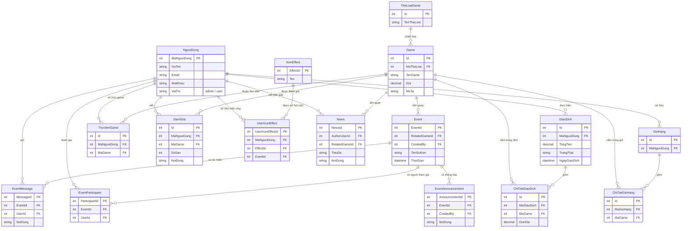

# GameStore — Nền tảng phân phối game trực tuyến

Ứng dụng web bán và quản lý game theo mô hình cửa hàng số (digital game store): duyệt và mua game, thư viện game cá nhân, đánh giá, tin tức, sự kiện có chat thời gian thực, trợ lý AI và thanh toán trực tuyến. Dự án xây dựng bằng **ASP.NET Core MVC (.NET 8)** với **PostgreSQL** và **SignalR**.

## Mục lục
- [Tính năng chính](#tính-năng-chính)
- [Công nghệ sử dụng](#công-nghệ-sử-dụng)
- [Kiến trúc tổng quan](#kiến-trúc-tổng-quan)
- [Cấu trúc thư mục](#cấu-trúc-thư-mục)
- [Sơ đồ cơ sở dữ liệu (ERD)](#sơ-đồ-cơ-sở-dữ-liệu-erd)
- [Cài đặt và chạy](#cài-đặt-và-chạy)
- [Cấu hình](#cấu-hình)
- [Hạn chế và hướng phát triển](#hạn-chế-và-hướng-phát-triển)

## Tính năng chính

**Khách hàng**
- Duyệt, tìm kiếm và lọc game theo thể loại; xem chi tiết game.
- Giỏ hàng và thanh toán trực tuyến qua **MoMo**.
- Thư viện game cá nhân (các game đã sở hữu sau khi mua).
- Đánh giá và nhận xét game.
- Đọc tin tức, tham gia sự kiện.
- Tham gia chat sự kiện và chat thời gian thực (SignalR).
- Trợ lý AI hỗ trợ trong ứng dụng.
- Tùy biến hiệu ứng icon/avatar mở khóa từ phần thưởng sự kiện.

**Quản trị viên**
- Quản lý game, thể loại, tin tức, sự kiện.
- Quản lý người dùng và tài khoản.
- Quản lý giao dịch và đơn hàng.
- Gửi thông báo trong sự kiện.

## Công nghệ sử dụng

- **Framework:** ASP.NET Core MVC (.NET 8)
- **Cơ sở dữ liệu:** PostgreSQL
- **ORM:** Entity Framework Core (Npgsql provider)
- **Real-time:** SignalR (chat sự kiện, chat AI, tương tác game)
- **Xác thực:** Cookie Authentication + Session
- **Thanh toán:** VNPay, MoMo
- **Email:** SMTP (MailHelper)
- **Giao diện:** Razor Views (.cshtml), wwwroot (CSS/JS)

## Kiến trúc tổng quan

Dự án theo mô hình **MVC kết hợp tầng Service** (tách logic nghiệp vụ khỏi Controller):

```
Trình duyệt
    |
Controllers (nhận request, điều phối)
    |
Services (logic nghiệp vụ — interface + implementation)
    |
GameStoreContext (EF Core DbContext)
    |
PostgreSQL
```

Ngoài luồng request MVC truyền thống, ứng dụng dùng **SignalR Hubs** cho các tính năng thời gian thực:
- `EventChatHub` / `ChatHub` — chat trong sự kiện.
- `AiChatHub` — trò chuyện với trợ lý AI.
- `GameHub` — tương tác liên quan game theo thời gian thực.

Tầng Service được đăng ký bằng **Dependency Injection** trong `Program.cs` (mỗi nghiệp vụ có cặp interface + implementation, ví dụ `GameService` / `GameServiceImpl`), giúp code dễ kiểm thử và thay thế.

## Cấu trúc thư mục

```
GameStore/
├── Program.cs              # Điểm cấu hình ứng dụng (DI, DB, Auth, SignalR, Hub)
├── Controllers/            # Controller (Admin, Auth, Client, Event, News, Vnpay, ...)
├── Models/                 # Entity + GameStoreContext (EF Core DbContext)
├── Services/               # Tầng nghiệp vụ (Game, Cart, Payment, Event, Ai, ...)
├── Hubs/                   # SignalR Hubs (ChatHub, EventChatHub, AiChatHub, GameHub)
├── Views/                  # Razor Views (.cshtml) theo từng khu vực
├── Helpers/                # Tiện ích (MailHelper)
├── Pagination/             # Hỗ trợ phân trang
├── Migrations/             # EF Core migrations
├── wwwroot/                # Tài nguyên tĩnh (CSS, JS, ảnh, thư viện)
└── database/               # Script / tài liệu database
```

## Sơ đồ cơ sở dữ liệu (ERD)

Cơ sở dữ liệu gồm 16 thực thể chính. Sơ đồ dưới đây (GitHub tự render khối `mermaid`):



### Các nhóm quan hệ chính

- **Cửa hàng & mua bán:** `TheLoaiGame → Game`; `NguoiDung → GioHang → ChiTietGioHang → Game` (giỏ hàng); `NguoiDung → GiaoDich → ChiTietGiaoDich → Game` (đơn hàng); sau khi thanh toán, game vào `ThuVienGame` của người dùng.
- **Đánh giá:** `NguoiDung` + `Game → DanhGia`.
- **Sự kiện:** `Event` liên kết với `Game` và người tạo (`CreatedBy`); có `EventParticipant`, `EventMessage`, `EventAnnouncement`.
- **Hiệu ứng icon (gamification):** `IconEffect` ↔ `NguoiDung` qua bảng trung gian `UserIconEffect` (gắn với sự kiện mở khóa).
- **Tin tức:** `News` có tác giả (`AuthorUserId`) và game liên quan (`RelatedGameId`).

## Cài đặt và chạy

### Yêu cầu
- .NET 8 SDK
- PostgreSQL

### Các bước
1. Cấu hình chuỗi kết nối PostgreSQL trong `appsettings.json`.
2. Khôi phục package và áp dụng migration:
   ```bash
   dotnet restore
   dotnet ef database update
   ```
3. Chạy ứng dụng:
   ```bash
   dotnet run
   ```
4. Mở trình duyệt tới địa chỉ hiển thị trong console (ví dụ `https://localhost:5001`).

## Cấu hình

Các thông tin nhạy cảm đặt trong `appsettings.json` (không commit lên Git):
- Chuỗi kết nối PostgreSQL.
- Thông tin SMTP gửi email.
- Khóa và thông tin merchant của **VNPay**, **MoMo**.
- Cấu hình dịch vụ AI.

> Khuyến nghị: dùng `appsettings.Development.json` hoặc User Secrets cho môi trường phát triển, và thêm các file chứa khóa vào `.gitignore`.

## Hạn chế và hướng phát triển
- Tích hợp thanh toán hiện ở môi trường sandbox/test; cần cấu hình merchant thật khi triển khai production.
- Có thể bổ sung kiểm thử tự động (unit test cho tầng Service).
- Có thể tách frontend thành SPA hoặc bổ sung API cho ứng dụng di động.

---

Dự án được xây dựng cho mục đích học tập và thực hành phát triển web với ASP.NET Core MVC, EF Core và các tính năng nâng cao như real-time (SignalR) và tích hợp cổng thanh toán.
